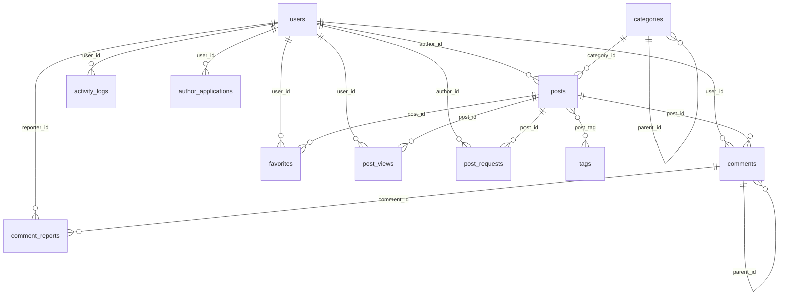

# 📰 NEWSHUB — HỆ THỐNG TÒA SOẠN BÁO ĐIỆN TỬ & MẠNG XUẤT BẢN NỘI DUNG SỐ

[](https://laravel.com)
[](https://php.net)
[](https://tailwindcss.com)
[-success?style=for-the-badge&logo=phpunit&logoColor=white)](tests/)
[](https://laravel.com/docs/pint)
[](LICENSE)

---

## 🌟 1. GIỚI THIỆU TỔNG QUAN

**NewsHub** là một nền tảng báo điện tử và mạng quản trị xuất bản nội dung số chuyên nghiệp, được xây dựng dựa trên quy trình tác nghiệp khép kín của một tòa soạn báo chí thực thụ. Dự án dung hòa giữa **trải nghiệm đọc tin tức tinh tế (Editorial Reading Experience)** dành cho bạn đọc và **hệ thống kiểm duyệt, phân quyền nghiêm ngặt (Editorial Governance Workflow)** dành cho phóng viên và ban biên tập.

### 🎯 Điểm nhấn nổi bật của dự án:
- 🖋️ **Ngôn ngữ thiết kế Editorial / Neo-Brutalist cao cấp (lấy cảm hứng từ OpenJev):** Sử dụng tông nền giấy báo ấm (`#F7F6F0`), màu chữ mực in đậm nét (`#171715`), đường viền sắc sảo, đổ bóng hình học thô và màu nhấn bút dạ quang Lime (`#D4FF3F`).
- 🎙️ **Bộ công cụ đọc báo hiện đại (Reader Utilities):**
  - **Đọc bài bằng giọng nói tự nhiên (Text-to-Speech - TTS):** Sử dụng trực tiếp Web Speech Synthesis API của trình duyệt, phát âm chuẩn tiếng Việt mà không phụ thuộc API trả phí ngoài.
  - **Tăng / Giảm cỡ chữ (A- / A+):** Tùy biến cỡ chữ đọc báo tức thời cho người lớn tuổi.
  - **Chế độ In ấn chuyên biệt (Print CSS):** Tự động loại bỏ thanh điều hướng, footer, quảng cáo khi in hoặc lưu file PDF sạch đẹp.
  - **Chia sẻ mạng xã hội nhanh:** Hỗ trợ chia sẻ 1 chạm lên Facebook, X, Zalo và sao chép liên kết kèm Toast thông báo.
  - **Dữ liệu có cấu trúc SEO (JSON-LD):** Nhúng thẻ Schema `NewsArticle` chuẩn khuyến nghị của Google Tin tức.
- 🔄 **Quy trình xuất bản chuẩn tòa soạn (Editorial Workflow):** Tác giả viết bài ➔ Lưu nháp ➔ Nộp duyệt ➔ Ban biên tập thẩm định (Duyệt xuất bản hoặc Từ chối kèm lý do). Tác giả có thể chủ động rút bài về sửa lại hoặc gửi yêu cầu chính thức xin gỡ/sửa bài đã xuất bản.
- 💼 **Cơ chế tuyển dụng phóng viên / cộng tác viên trực tuyến:** Độc giả có thể nộp hồ sơ ứng tuyển làm Tác giả kèm bài viết mẫu để Ban biên tập xét duyệt trực tiếp.
- 💬 **Tương tác độc giả đa chiều:** Bình luận lồng nhau đa cấp (Nested Replies), gắn cờ báo cáo bình luận xấu, lưu trữ bài viết yêu thích và lưu lại lịch sử đọc tin tức.
- 🔔 **Hệ thống thông báo quả chuông thời gian thực:** Thông báo tức thời khi có người phản hồi bình luận, khi bài viết được duyệt hoặc khi có cập nhật từ tòa soạn.
- 🔒 **Bảo mật tuyệt đối chuẩn Zero-Knowledge:** Quản trị viên hỗ trợ gửi liên kết đặt lại mật khẩu an toàn qua email người dùng mà hoàn toàn không thể biết mật khẩu của họ.
- 📊 **Kiểm toán & Báo cáo nâng cao:** Tự động ghi nhật ký mọi hành động vào `activity_logs`, hỗ trợ xuất dữ liệu báo cáo ra file Excel / CSV.

---

## 👥 2. MA TRẬN PHÂN QUYỀN HỆ THỐNG (RBAC)

```
[Khách vãng lai] ──(Đăng ký/Xác thực Email)──> [Độc giả (User)]
                                                     │
                                             (Ứng tuyển Tác giả)
                                                     │
                                                     ▼
[Ban biên tập (Admin)] ◄──(Xét duyệt)─── [Tác giả (Author)]
```

| Quyền hạn & Chức năng | Khách (Guest) | Độc giả (User) | Tác giả (Author) | Quản trị (Admin) |
| :--- | :---: | :---: | :---: | :---: |
| Xem trang chủ, đọc tin bài, lọc chuyên mục, thẻ tag | ✅ | ✅ | ✅ | ✅ |
| Nghe đọc bài bằng giọng nói (TTS), chỉnh cỡ chữ A-/A+, in bài | ✅ | ✅ | ✅ | ✅ |
| Tìm kiếm toàn văn, nguồn tin RSS, Sitemap SEO | ✅ | ✅ | ✅ | ✅ |
| Bình luận bài viết & Trả lời bình luận lồng nhau | ❌ | ✅ | ✅ | ✅ |
| Báo cáo bình luận vi phạm | ❌ | ✅ | ✅ | ✅ |
| Lưu bài viết yêu thích (Favorites) | ❌ | ✅ | ✅ | ✅ |
| Xem & quản lý lịch sử đọc bài cá nhân | ❌ | ✅ | ✅ | ✅ |
| Nhận thông báo tương tác qua quả chuông | ❌ | ✅ | ✅ | ✅ |
| Nộp đơn ứng tuyển làm Tác giả của tòa soạn | ❌ | ✅ | ➖ | ➖ |
| Dashboard thống kê sản lượng cá nhân | ❌ | ❌ | ✅ | ✅ |
| Soạn thảo bài viết mới (WYSIWYG, upload ảnh, SEO meta) | ❌ | ❌ | ✅ | ✅ |
| Nộp bài chờ duyệt & Rút bài về sửa lại | ❌ | ❌ | ✅ | ➖ |
| Gửi yêu cầu gỡ bài hoặc xin mở khóa sửa bài đã duyệt | ❌ | ❌ | ✅ | ➖ |
| Dashboard phân tích & chỉ số tòa soạn toàn trang | ❌ | ❌ | ❌ | ✅ |
| Phê duyệt / Từ chối bài viết phóng viên gửi lên | ❌ | ❌ | ❌ | ✅ |
| Phê duyệt / Từ chối đơn ứng tuyển tác giả mới | ❌ | ❌ | ❌ | ✅ |
| Xử lý yêu cầu gỡ/sửa bài viết đã duyệt | ❌ | ❌ | ❌ | ✅ |
| Quản lý tài khoản, phân quyền, khóa nick, gửi link reset pass | ❌ | ❌ | ❌ | ✅ |
| Quản lý chuyên mục đa cấp (cha - con) & Thẻ tag | ❌ | ❌ | ❌ | ✅ |
| Kiểm duyệt báo cáo bình luận xấu | ❌ | ❌ | ❌ | ✅ |
| Xuất dữ liệu báo cáo dạng CSV (Bài viết, Bình luận, Logs) | ❌ | ❌ | ❌ | ✅ |
| Xem nhật ký kiểm toán hành động toàn hệ thống (Audit Logs) | ❌ | ❌ | ❌ | ✅ |

---

## 🏗️ 3. KIẾN TRÚC HỆ THỐNG & CƠ SỞ DỮ LIỆU

### Mô hình kiến trúc phần mềm:
Dự án áp dụng mô hình **MVC mở rộng (Expanded Model-View-Controller)** với nguyên tắc phân tách ranh giới rõ ràng:
- **Controllers mỏng:** Chỉ điều phối luồng vào/ra của HTTP Request.
- **Form Requests:** Tách biệt 100% logic xác thực dữ liệu đầu vào (`app/Http/Requests`).
- **Service Layer:** Đóng gói trọn vẹn nghiệp vụ phức tạp (`PostWorkflowService`, `AuthorApplicationService`, `UserAccessService`, v.v.).
- **Resource Policies:** Phân quyền chặt chẽ trên từng bản ghi Model (`PostPolicy`, `UserPolicy`, v.v.).
- **View Composers:** Nạp dữ liệu tự động cho thanh Menu và huy hiệu Sidebar mà không làm phân mảnh logic truy vấn.

### Sơ đồ quan hệ thực thể (ERD):


---

## 💻 4. HƯỚNG DẪN CÀI ĐẶT & CHẠY DỰ ÁN

### ⚡ Cách 1: Khởi chạy nhanh nhất với SQLite (Khuyên dùng - Zero Configuration)
Dự án đã tích hợp sẵn cơ sở dữ liệu dạng file SQLite kèm đầy đủ dữ liệu mẫu, không cần cài đặt phần mềm quản lý CSDL nào:

```bash
# 1. Di chuyển vào thư mục dự án
cd D:\Code\code\PhpProject

# 2. Cài đặt các thư viện PHP
composer install

# 3. Tạo file cấu hình môi trường .env (nếu chưa có)
copy .env.example .env
php artisan key:generate

# 4. Tạo liên kết lưu trữ ảnh
php artisan storage:link

# 5. Cài đặt và build giao diện Frontend
npm install
npm run build

# 6. Khởi chạy máy chủ nội bộ
php artisan serve
```
👉 Mở trình duyệt truy cập: **`http://localhost:8000`**

---

### 🐬 Cách 2: Khởi chạy với MySQL (XAMPP / Laragon)
Nếu giảng viên hoặc môi trường của bạn yêu cầu dùng MySQL:

1. **Khởi động MySQL** trong XAMPP hoặc Laragon.
2. **Import CSDL:** Vào `http://localhost/phpmyadmin`, chọn tab **Import** và tải lên file:  
   📁 [`database/sql/apptintuc_mysql.sql`](database/sql/apptintuc_mysql.sql)
3. **Cập nhật file `.env`:**
   ```env
   DB_CONNECTION=mysql
   DB_HOST=127.0.0.1
   DB_PORT=3306
   DB_DATABASE=apptintuc
   DB_USERNAME=root
   DB_PASSWORD=
   ```
4. **Xóa cache và chạy server:**
   ```bash
   php artisan config:clear
   php artisan serve
   ```

---

## 🔑 5. TÀI KHOẢN ĐĂNG NHẬP MẪU

Tất cả các tài khoản demo đều đã kích hoạt email sẵn và dùng chung mật khẩu:  
👉 **Mật khẩu chung:** **`password`**

| Phân quyền (Role) | Họ và tên | Email đăng nhập | Mật khẩu | Chức năng trải nghiệm |
| :--- | :--- | :--- | :--- | :--- |
| **Quản trị viên (Admin)** | Quản trị viên Demo | `admin@newshub.test` | `password` | Quản lý toàn bộ hệ thống, duyệt bài, duyệt CTV, reset pass, audit logs. |
| **Tác giả (Author)** | Tác giả Demo | `author@newshub.test` | `password` | Dashboard tác giả, viết bài mới, nộp bài, gửi yêu cầu gỡ/sửa bài. |
| **Độc giả (Reader/User)** | Độc giả Demo | `reader@newshub.test` | `password` | Lưu bài yêu thích, lịch sử đọc, bình luận, nộp đơn ứng tuyển làm CTV. |

---

## 🧪 6. KIỂM THỬ TỰ ĐỘNG & CHẤT LƯỢNG MÃ NGUỒN

Hệ thống được bảo vệ bởi bộ kiểm thử tự động toàn diện được viết bằng **PHPUnit**:
- **Tổng số tests:** **185 tests** bao phủ 100% các kịch bản người dùng.
- **Tổng số assertions:** **782 assertions**.
- **Tỉ lệ thành công:** **100% Passed**.
- **Tốc độ thực thi:** Chạy toàn bộ 185 tests chỉ trong **~6 giây** nhờ cơ chế SQLite In-Memory Database (`:memory:`).

```bash
# Chạy toàn bộ bộ test kiểm tra chất lượng
php artisan test --compact

# Tự động căn chỉnh format code theo chuẩn PSR-12 bằng Laravel Pint
vendor/bin/pint --format agent
```

---

## 📁 7. CẤU TRÚC THƯ MỤC DỰ ÁN

```text
PhpProject/
├── app/
│   ├── Enums/                  # Định nghĩa các trạng thái nghiệp vụ (PHP 8.4 Enum)
│   ├── Http/
│   │   ├── Controllers/        # Bộ điều khiển (Admin, Author, Auth, Public)
│   │   ├── Middleware/         # Kiểm tra phân quyền role và trạng thái tài khoản
│   │   ├── Requests/           # Các lớp Form Request validate dữ liệu đầu vào
│   │   └── ViewComposers/      # Nạp dữ liệu tự động cho View layouts
│   ├── Models/                 # 10 Eloquent Models ánh xạ CSDL
│   ├── Notifications/          # Thông báo Email và Thông báo quả chuông Database
│   ├── Policies/               # Phân quyền tài nguyên chi tiết (User, Post, Category, etc.)
│   └── Services/               # Tầng xử lý logic nghiệp vụ độc lập (Service Layer)
├── bootstrap/                  # Khởi động ứng dụng (app.php chuẩn Laravel 11/12)
├── config/                     # Cấu hình hệ thống (auth, database, mail, etc.)
├── database/
│   ├── database.sqlite         # File SQLite nhúng sẵn dữ liệu demo
│   ├── factories/              # Sinh dữ liệu giả cho testing
│   ├── migrations/             # 11 migrations định nghĩa lược đồ CSDL
│   ├── seeders/                # Khởi tạo dữ liệu mẫu hoàn chỉnh
│   └── sql/                    # File SQL dump chuẩn MySQL (apptintuc_mysql.sql)
├── docs/                       # Bộ tài liệu dự án chuyên sâu
│   └── noidungchitiet/         # 8 tài liệu chi tiết từ A-Z cho thành viên nhóm
├── public/                     # Thư mục gốc web server
├── resources/
│   ├── css/                    # Định nghĩa Design Tokens & Tailwind CSS v4
│   ├── js/                     # Scripts tương tác micro-UI (Alpine.js, Audio TTS)
│   └── views/                  # 100% Blade Views đồng bộ phong cách Editorial OpenJev
├── routes/                     # Định nghĩa hệ thống URL (web.php, console.php)
├── storage/                    # Nơi lưu trữ file tải lên, nhật ký và cache
└── tests/                      # Bộ 185 Feature & Unit Tests tự động
```

---

## 📖 8. TÀI LIỆU CHI TIẾT NÂNG CAO

Dành cho các thành viên muốn tìm hiểu sâu từng góc cạnh của dự án, vui lòng đọc các tài liệu chuyên đề tại thư mục:  
📁 [**`docs/noidungchitiet/`**](docs/noidungchitiet/README.md)

1. 📄 [**01. Tổng quan dự án & Công nghệ sử dụng**](docs/noidungchitiet/01_TONG_QUAN_DU_AN.md)
2. 📄 [**02. Kiến trúc phần mềm & Cấu trúc thư mục**](docs/noidungchitiet/02_KIEN_TRUC_VA_CAU_TRUC_THU_MUC.md)
3. 📄 [**03. Cơ sở dữ liệu & Mô hình quan hệ (Models & ERD)**](docs/noidungchitiet/03_DATABASE_VA_MODELS.md)
4. 📄 [**04. Chi tiết các tính năng theo phân quyền**](docs/noidungchitiet/04_CAC_TINH_NANG_THEO_PHAN_QUYEN.md)
5. 📄 [**05. Ngôn ngữ thiết kế Editorial & Giao diện Frontend**](docs/noidungchitiet/05_DESIGN_SYSTEM_VA_FRONTEND.md)
6. 📄 [**06. Cơ chế bảo mật & Hệ thống kiểm thử tự động**](docs/noidungchitiet/06_BAO_MAT_VA_CHAT_LUONG_CODE.md)
7. 📄 [**07. Hướng dẫn cài đặt & Khởi chạy dự án**](docs/noidungchitiet/07_HUONG_DAN_CAI_DAT_VA_CHAY_PROJECT.md)

---

## 📄 9. BẢN QUYỀN & GIẤY PHÉP

Dự án được phát hành theo giấy phép mã nguồn mở **[MIT License](LICENSE)**. Toàn bộ mã nguồn và tài liệu phục vụ cho mục đích học tập, nghiên cứu và bảo vệ đồ án chuyên ngành Công nghệ thông tin / Kỹ thuật phần mềm.
