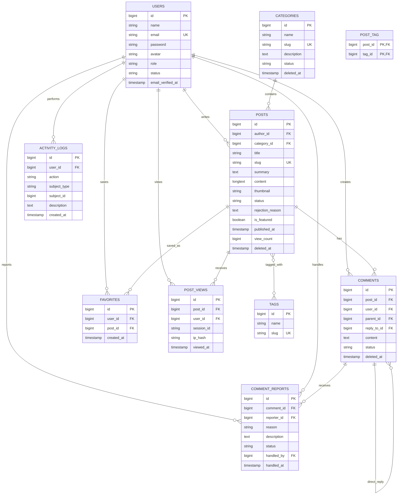

# ERD — Hệ thống quản lý và cung cấp tin tức

Sơ đồ dưới đây mô tả các bảng nghiệp vụ chính. Các bảng mặc định của Laravel như `sessions`, `cache`, `jobs` và `password_reset_tokens` không được vẽ để sơ đồ tập trung vào miền tin tức.

## Quy tắc quan trọng

- `posts.status`: `draft`, `pending_review`, `published`, `rejected`, `hidden`, `archived`.
- Chỉ bài `published` có `published_at` không lớn hơn thời điểm hiện tại mới xuất hiện công khai.
- `comments.parent_id` luôn trỏ về bình luận gốc; `reply_to_id` trỏ về bình luận được trả lời trực tiếp.
- `favorites` và `post_tag` có khóa duy nhất để tránh dữ liệu trùng.
- `comment_reports` giới hạn mỗi người dùng chỉ báo cáo một bình luận một lần.
- Các bảng `categories`, `posts`, `comments` dùng soft delete để không phá vỡ lịch sử và hội thoại.
