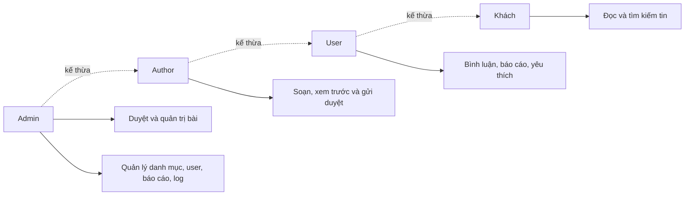
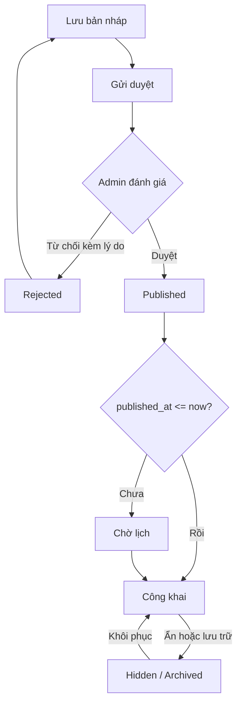
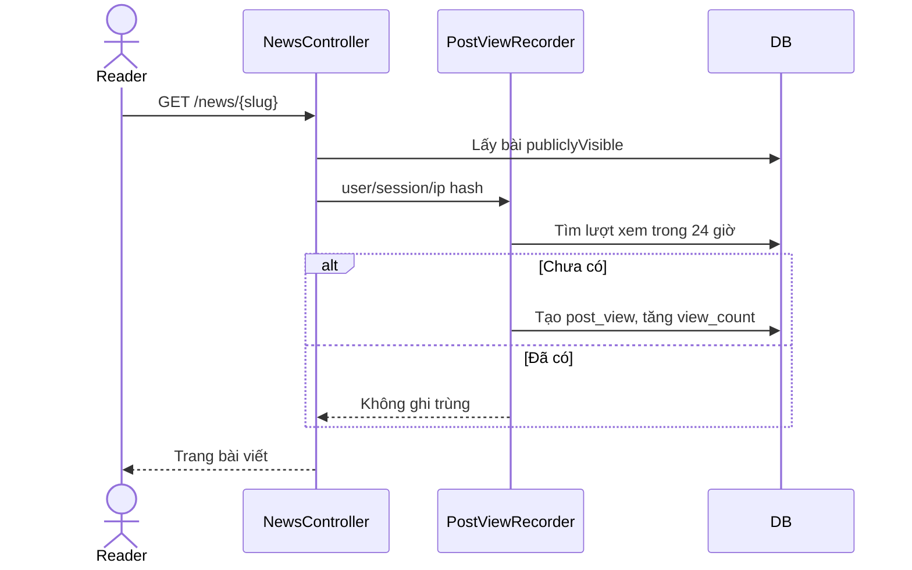
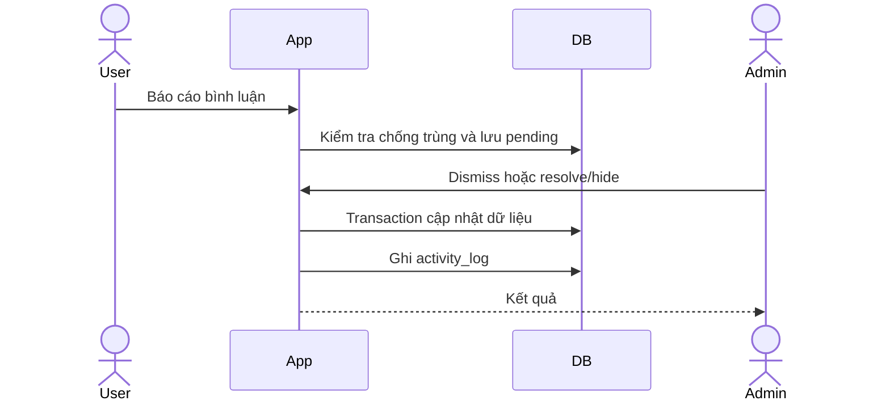

# Sơ đồ hệ thống NewsHub

## Use Case tổng quan

```mermaid
flowchart LR
    Guest[Khách] --> Read[Đọc và tìm kiếm tin]
    User[User] --> Comment[Bình luận, báo cáo, yêu thích]
    Author[Author] --> Draft[Soạn, xem trước và gửi duyệt]
    Admin[Admin] --> Review[Duyệt và quản trị bài]
    Admin --> Manage[Quản lý danh mục, user, báo cáo, log]
    User -. kế thừa .-> Guest
    Author -. kế thừa .-> User
    Admin -. kế thừa .-> Author
```

## Activity: xuất bản bài

```mermaid
flowchart TD
    A[Lưu bản nháp] --> B[Gửi duyệt]
    B --> C{Admin đánh giá}
    C -->|Từ chối kèm lý do| D[Rejected]
    D --> A
    C -->|Duyệt| E[Published]
    E --> F{published_at <= now?}
    F -->|Chưa| G[Chờ lịch]
    F -->|Rồi| H[Công khai]
    G --> H
    H -->|Ẩn hoặc lưu trữ| I[Hidden / Archived]
    I -->|Khôi phục| H
```

## Sequence: lượt xem chống trùng

```mermaid
sequenceDiagram
    actor Reader
    participant Web as NewsController
    participant Recorder as PostViewRecorder
    participant DB
    Reader->>Web: GET /news/{slug}
    Web->>DB: Lấy bài publiclyVisible
    Web->>Recorder: user/session/ip hash
    Recorder->>DB: Tìm lượt xem trong 24 giờ
    alt Chưa có
        Recorder->>DB: Tạo post_view, tăng view_count
    else Đã có
        Recorder-->>Web: Không ghi trùng
    end
    Web-->>Reader: Trang bài viết
```

## Sequence: xử lý báo cáo bình luận

```mermaid
sequenceDiagram
    actor User
    participant App
    participant DB
    actor Admin
    User->>App: Báo cáo bình luận
    App->>DB: Kiểm tra chống trùng và lưu pending
    Admin->>App: Dismiss hoặc resolve/hide
    App->>DB: Transaction cập nhật dữ liệu
    App->>DB: Ghi activity_log
    App-->>Admin: Kết quả
```
