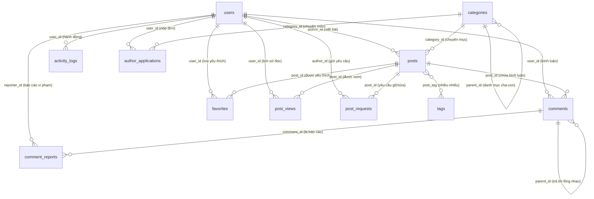

# 03. CƠ SỞ DỮ LIỆU & MÔ HÌNH QUAN HỆ (MODELS & ERD)

---

## 📊 1. SƠ ĐỒ QUAN HỆ THỰC THỂ (ERD)

Hệ thống được thiết kế theo chuẩn cơ sở dữ liệu quan hệ bậc 3 (3NF), đảm bảo tính toàn vẹn dữ liệu và tối ưu hiệu năng đọc tin tức:

---

## 🗄️ 2. CHI TIẾT CÁC BẢNG DỮ LIỆU CỐT LÕI

### 1. Bảng `users` (Tài khoản người dùng)
- `id` (PK, BigInt Unsigned)
- `name` (Varchar 255): Tên hiển thị của người dùng.
- `email` (Varchar 255, Unique): Địa chỉ email đăng nhập.
- `password` (Varchar 255): Mật khẩu được mã hóa bằng thuật toán Bcrypt.
- `role` (Varchar 50, Index): Phân quyền tài khoản (`user`, `author`, `admin`).
- `status` (Varchar 50, Index): Trạng thái hoạt động (`active`, `blocked`).
- `avatar` (Varchar 255, Nullable): Đường dẫn ảnh đại diện người dùng.
- `email_verified_at` (Timestamp, Nullable): Thời điểm người dùng kích hoạt email.

### 2. Bảng `categories` (Chuyên mục bài viết)
- `id` (PK, BigInt Unsigned)
- `parent_id` (FK tự trỏ, Nullable): Khóa ngoại trỏ đến chính `categories.id` để tạo danh mục cha - con đa cấp.
- `name` (Varchar 255): Tên chuyên mục (ví dụ: Công nghệ, Trí tuệ nhân tạo, v.v.).
- `slug` (Varchar 255, Unique): Đường dẫn thân thiện SEO (ví dụ: `cong-nghe`).
- `description` (Text, Nullable): Mô tả ngắn về chuyên mục.
- `status` (Varchar 50, Index): `active` hoặc `hidden`.

### 3. Bảng `tags` (Thẻ bài viết)
- `id` (PK, BigInt Unsigned)
- `name` (Varchar 255): Tên thẻ (ví dụ: Laravel, AI, OpenAI).
- `slug` (Varchar 255, Unique): Đường dẫn thẻ thân thiện SEO.

### 4. Bảng `posts` (Bài viết tin tức)
- `id` (PK, BigInt Unsigned)
- `author_id` (FK trỏ `users.id` on delete cascade): Tác giả sáng tạo bài viết.
- `category_id` (FK trỏ `categories.id` on delete restrict): Chuyên mục chứa bài viết.
- `title` (Varchar 255): Tiêu đề chính của bài báo.
- `slug` (Varchar 255, Unique): Đường dẫn URL duy nhất.
- `summary` (Text): Tóm tắt ngắn mở đầu bài báo (Sapo).
- `content` (LongText): Toàn bộ nội dung bài viết định dạng HTML phong phú.
- `thumbnail` (Varchar 255, Nullable): Ảnh đại diện bài viết.
- `show_thumbnail_in_post` (Boolean, Default 1): Tùy chọn hiển thị ảnh bìa bên trong nội dung bài viết hay không.
- `status` (Varchar 50, Index): Trạng thái bài (`draft`, `pending`, `published`, `hidden`, `archived`).
- `meta_title` (Varchar 255, Nullable): Tiêu đề tối ưu SEO tìm kiếm.
- `meta_description` (Varchar 500, Nullable): Đoạn mô tả hiển thị trên kết quả tìm kiếm Google.
- `view_count` (BigInt Unsigned, Default 0, Index): Tổng lượt xem bài viết.
- `is_featured` (Boolean, Default 0, Index): Đánh dấu bài viết nổi bật (Tiêu điểm / Spotlight).
- `published_at` (Timestamp, Nullable, Index): Thời điểm bài viết được chính thức xuất bản.

### 5. Bảng `post_tag` (Liên kết Bài viết - Thẻ)
- `post_id` (FK trỏ `posts.id` on delete cascade)
- `tag_id` (FK trỏ `tags.id` on delete cascade)
- Khóa chính tổng hợp: `PRIMARY KEY (post_id, tag_id)`

### 6. Bảng `comments` (Bình luận & Phản hồi)
- `id` (PK, BigInt Unsigned)
- `post_id` (FK trỏ `posts.id` on delete cascade)
- `user_id` (FK trỏ `users.id` on delete cascade)
- `parent_id` (FK trỏ `comments.id` on delete cascade, Nullable): Trỏ đến bình luận gốc cao nhất.
- `reply_to_id` (FK trỏ `comments.id` on delete cascade, Nullable): Trỏ đến bình luận trực tiếp được trả lời (hỗ trợ tag tên người được reply).
- `content` (Text): Nội dung bình luận.
- `status` (Varchar 50, Index): `visible` hoặc `hidden`.

### 7. Bảng `comment_reports` (Báo cáo bình luận vi phạm)
- `id` (PK, BigInt Unsigned)
- `comment_id` (FK trỏ `comments.id` on delete cascade)
- `reporter_id` (FK trỏ `users.id` on delete cascade): Người gửi báo cáo.
- `handled_by` (FK trỏ `users.id` on delete set null, Nullable): Admin xử lý báo cáo.
- `reason` (Text): Lý do báo cáo vi phạm.
- `status` (Varchar 50, Index): `pending`, `resolved`, `dismissed`.
- `admin_notes` (Text, Nullable): Ghi chú xử lý của ban quản trị.

### 8. Bảng `favorites` (Bài viết yêu thích của người dùng)
- `id` (PK, BigInt Unsigned)
- `user_id` (FK trỏ `users.id` on delete cascade)
- `post_id` (FK trỏ `posts.id` on delete cascade)
- `UNIQUE KEY (user_id, post_id)`: Một người dùng chỉ có thể lưu một bài viết một lần.

### 9. Bảng `post_views` (Nhật ký lượt xem & Lịch sử đọc bài)
- `id` (PK, BigInt Unsigned)
- `post_id` (FK trỏ `posts.id` on delete cascade)
- `user_id` (FK trỏ `users.id` on delete cascade, Nullable): Lưu lại nếu người xem đã đăng nhập.
- `session_id` (Varchar 255, Nullable, Index)
- `ip_hash` (Varchar 64, Index): Băm SHA-256 địa chỉ IP để chống spam lượt xem mà vẫn đảm bảo tính riêng tư.
- `viewed_at` (Timestamp, Index): Thời điểm xem bài.

### 10. Bảng `activity_logs` (Nhật ký kiểm toán tòa soạn)
- `id` (PK, BigInt Unsigned)
- `user_id` (FK trỏ `users.id` on delete cascade): Người thực hiện hành động.
- `action` (Varchar 100, Index): Tên hành động (`post.approved`, `post.rejected`, `user.access-updated`, `user.password-reset-sent`, etc.).
- `subject_type` (Varchar 255): Tên lớp Model bị tác động (`App\Models\Post`, `App\Models\User`, etc.).
- `subject_id` (BigInt Unsigned, Nullable): ID của bản ghi bị tác động.
- `description` (Text): Diễn giải chi tiết bằng tiếng Việt để phục vụ báo cáo tòa soạn.
- `created_at` (Timestamp, Index)

### 11. Bảng `author_applications` (Đơn ứng tuyển tác giả)
- `id` (PK, BigInt Unsigned)
- `user_id` (FK trỏ `users.id` on delete cascade)
- `pending_user_id` (BigInt Unsigned, Nullable, Unique): Dùng ràng buộc duy nhất để mỗi tài khoản chỉ có tối đa 1 đơn chờ duyệt tại một thời điểm.
- `category_id` (FK trỏ `categories.id` on delete cascade): Lĩnh vực chuyên môn muốn viết.
- `bio` (Text): Giới thiệu bản thân và kinh nghiệm viết lách.
- `sample_title` (Varchar 255): Tiêu đề bài viết mẫu.
- `sample_content` (Text): Nội dung bài viết mẫu để ban biên tập thẩm định văn phong.
- `status` (Varchar 50, Index): `pending`, `approved`, `rejected`.
- `rejection_reason` (Varchar 255, Nullable): Lý do từ chối nếu không đạt.
- `reviewed_by` (FK trỏ `users.id` on delete set null, Nullable): Admin xét duyệt đơn.

### 12. Bảng `post_requests` (Yêu cầu gỡ / sửa bài viết đã xuất bản)
- `id` (PK, BigInt Unsigned)
- `post_id` (FK trỏ `posts.id` on delete cascade)
- `pending_post_id` (BigInt Unsigned, Nullable, Unique): Đảm bảo 1 bài viết chỉ có tối đa 1 yêu cầu chờ xử lý.
- `author_id` (FK trỏ `users.id` on delete cascade): Tác giả sở hữu bài viết gửi yêu cầu.
- `type` (Varchar 50): Loại yêu cầu (`takedown` - xin gỡ bài; `update` - xin mở khóa bài để sửa nội dung).
- `priority` (Varchar 50): Mức độ khẩn cấp (`normal`, `urgent`).
- `reason` (Varchar 255): Lý do tóm tắt.
- `notes` (Text): Giải trình chi tiết gửi đến ban biên tập.
- `status` (Varchar 50, Index): `pending`, `approved`, `rejected`.
- `admin_notes` (Text, Nullable): Lời nhắn phản hồi của ban biên tập.
- `handled_by` (FK trỏ `users.id` on delete set null, Nullable): Admin phê duyệt.

### 13. Bảng `notifications` (Hệ thống thông báo trong ứng dụng)
- `id` (UUID - Char 36, PK)
- `type` (Varchar 255): Tên lớp Notification.
- `notifiable_type`, `notifiable_id` (Morph columns): Ánh xạ đến đối tượng nhận thông báo (`User`).
- `data` (Text - JSON): Dữ liệu chi tiết của thông báo (tiêu đề, lời nhắn, icon, link liên kết).
- `read_at` (Timestamp, Nullable): Đánh dấu đã đọc.

---

## ⚡ 3. CHIẾN LƯỢC TỐI ƯU HIỆU NĂNG DATABASE (INDEXING)

Để trang web luôn tải dưới 100ms ngay cả khi có hàng chục ngàn bài viết, hệ thống đã được đánh chỉ mục cẩn thận:
- **`posts(status, published_at)`:** Tối ưu các truy vấn hiển thị bài mới nhất ngoài trang chủ và chuyên mục.
- **`posts(view_count)`:** Tối ưu hóa truy vấn bài viết được đọc nhiều nhất (Top Trending).
- **`comments(post_id, parent_id, created_at)`:** Tối ưu truy vấn luồng bình luận lồng nhau theo thứ tự thời gian.
- **`activity_logs(action, created_at)` & `activity_logs(user_id, created_at)`:** Đảm bảo trang kiểm toán của Admin lọc nhanh dữ liệu lớn.
